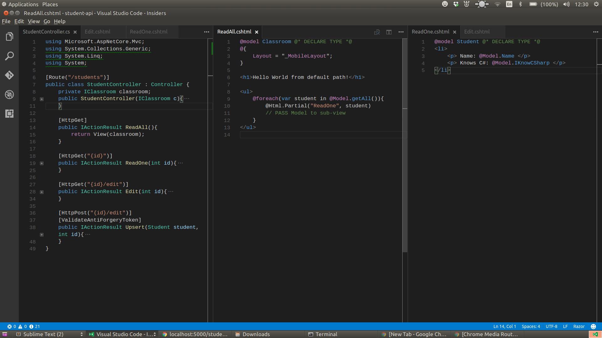

# 10-27-2016

## Tips for GoogleMaps API Homework

```c#
public class Size
{
    public int width { get; set; }
    public int height { get; set; }
}

public class Location
{
    public double lat { get; set; }
    public double lng { get; set; }
}

public class Marker
{
    public string color { get; set; }
    public string label { get; set; }
    public Location location { get; set; }
}

public class RootObject
{
    public string imageUrl { get; set; }
    public string timestamp { get; set; }
    public string searchTerm { get; set; }
    public int zoomLevel { get; set; }
    public Size size { get; set; }
    public List<Marker> markers { get; set; }
}


-----------
// -> /api/map/{search}?zoom=16&size=600x300
public async Task<IActionResult> GetData(string search, string size, string zoom){
    var json = await getAsyncString(url...)
    GoogleObject g = JsonConvert.Deserialize<GoogleObject>(json);
    Location l = g.results[0].geometry.location;

    var data = new RootObject {
        imageUrl = "...",
        timestamp = DateTime.Now.ToString(),
        searchTerm = search,
        size = size,
        zoomLevel = zoom,
        markers = new List<Marker> {
            new Marker {
                color = "red",
                label = "X",
                location = l
             }
        }
    };
    return Ok(data);
}
```

## Student API

https://github.com/TIY-Houston-dot-NET-Engineering/student-api

## Screenshot of `@Html.Partial()` conventions

